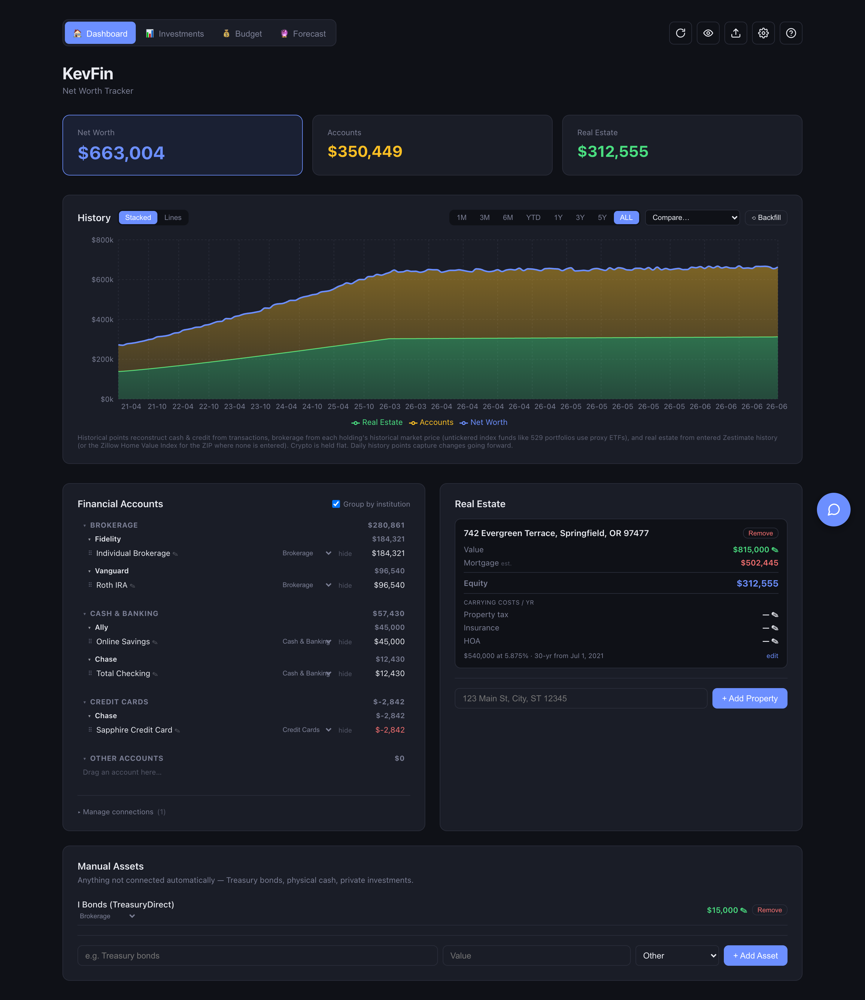
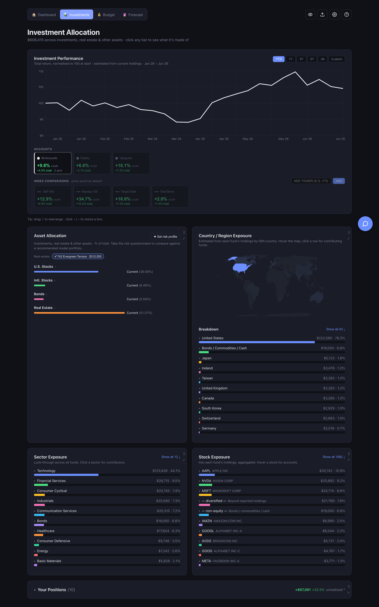
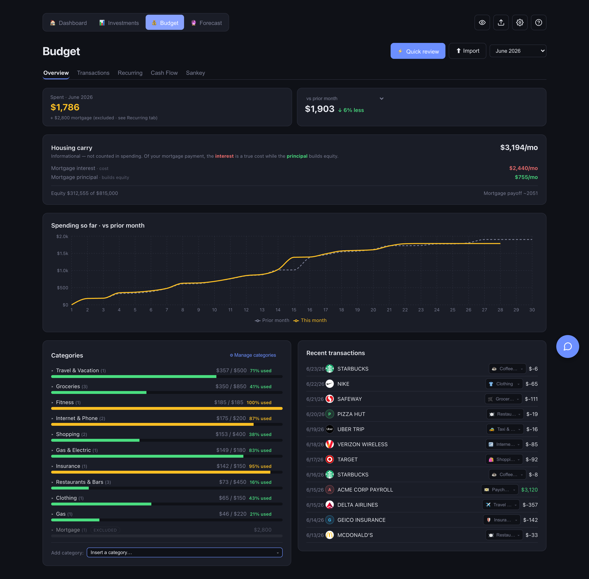
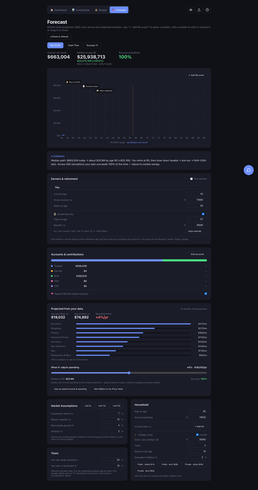

# KevFin

A self-hosted personal net-worth tracker. KevFin pulls your bank, brokerage, and
credit accounts together with your real estate into one private dashboard, then
layers on investment allocation analysis, budgeting, cash-flow, and a Monte Carlo
retirement forecast. It runs entirely on your own machine (or home server) — your
financial data never leaves it.

> **All data in the screenshots below is fictional**, generated by the demo
> seeder (see [Demo data](#demo-data)). KevFin stores nothing in this repository.

## Screenshots

### Dashboard — net worth over time
Accounts, real estate, and manual assets combined into a single net-worth line
you can break down, backfill ~5 years of history for, and compare against an index.



### Investments — allocation & look-through
Holdings are de-aggregated through funds to real asset classes, sectors, regions,
and underlying stocks, with performance normalized across accounts.



### Budget — spending by category
Transactions are auto-categorized (Monarch-style taxonomy) into targets, with a
cash-flow Sankey and recurring-bill detection.



### Forecast — Monte Carlo retirement projection
Your actual tax-bucketed balances and spending drive a 400-path simulation with
adjustable assumptions.



## Features

- **Net worth** — daily history points, ~5-year backfill (cash/credit from
  transactions, brokerage from holdings × historical prices, real estate from a
  Zestimate history or the Zillow Home Value Index), and index comparison.
- **Accounts** — connect institutions via [SimpleFIN](https://www.simplefin.org/) or
  [Plaid](https://plaid.com/); rename, recategorize (drag & drop), and hide accounts.
- **Real estate** — track properties with an amortized mortgage estimator so equity
  reflects paydown to date.
- **Investments** — fund look-through to asset class / sector / region / individual
  stock, with manual asset-class overrides.
- **Budget** — auto-categorized spending vs. targets, a cash-flow Sankey, an
  all-transactions view, and automatic recurring-bill detection.
- **Forecast** — Monte Carlo retirement model seeded from your real tax buckets
  (taxable / pre-tax / Roth / HSA / college) and spending.
- **AI assistant** — ask questions about your finances in plain English
  (see [below](#how-the-ai-assistant-is-routed)).
- **Encrypted snapshot export** — share a read-only, password-protected copy of
  your dashboard as a single offline HTML file (see [below](#sharing--data-control)).
- **Backups & data control** — download, restore, or wipe your database, and manage
  sync automation, all from the in-app **Setup** hub (see [below](#sharing--data-control)).
- **Privacy mode** — one click masks every dollar figure on screen.

## Sharing & data control

Everything operational lives behind the **gear icon (Setup)** in the top bar:
sync status, automation, backups, and the snapshot export. There are two distinct
ways to get your data out — one to *share*, one to *keep*:

### Encrypted snapshot export (to share)
Produces a single **password-protected HTML file** capturing all current data —
net worth, accounts, allocation, performance, and budget — frozen at that moment.

- **Self-contained & offline.** The file embeds its own viewer; the recipient just
  opens it in any browser and types the password. No server, no KevFin install.
- **Encrypted client-side.** The payload is AES-256-GCM encrypted with a key derived
  from your password via PBKDF2 (600k iterations). The password is used once to
  encrypt and is never stored; the data is unreadable without it.
- **Optional expiry.** Set a date after which the viewer refuses to render. This is a
  *courtesy* limit (enforced only by the viewer, not cryptographically) — fine for a
  spouse or advisor, not a defense against a determined adversary.

Great for handing someone a point-in-time read-only view without giving them access
to the live app.

### Backups (to keep)
A backup is the **live SQLite database**, for migration or disaster recovery —
different from the read-only snapshot above.

- **Download backup** — a consistent full copy of `kevfin.db`.
- **Restore from backup** — upload a `.db`; it's validated, and your current database
  is automatically copied aside first as a safety net before the swap.
- **Erase all data** — a full reset that empties every user table (API keys in
  `server/.env` are untouched).

### Sync automation
The Setup hub also shows when accounts, real estate, and net worth were last
recorded, and lets you toggle the **automatic daily net-worth history point** on or
off without restarting the server.

## How the AI assistant is routed

The built-in assistant **does not use a paid API key.** It shells out to your
**locally installed [Claude Code](https://claude.com/claude-code) binary** in
headless mode, which runs on whatever Claude login exists on that machine — so it
draws on your own Claude subscription, on your own computer. No credentials are
stored in this repo, and nothing routes to anyone else's account.

Resolution order for the binary (`server/src/services/assistant.ts`):
1. `CLAUDE_BIN` in `server/.env`
2. a `claude` on your `PATH`
3. the binary bundled in the macOS Claude desktop app

If no binary is found, the assistant is simply disabled — the rest of the app works
normally. Queries run with `--allowedTools none`, so the model only sees the compact
financial snapshot KevFin builds for it and cannot read files or run tools.

## Architecture

```
client/   React + Vite single-page app (dashboard, charts, budget, forecast)
server/   Express + TypeScript API, SQLite (better-sqlite3), daily cron history points
data/     SQLite database + backups (git-ignored — never committed)
```

- **Server** (port `3001`) exposes a `/api/*` REST surface and, in production,
  serves the built client from the same port.
- **Client** (Vite dev server, port `5173`) proxies `/api` to the server in dev.
- **Storage** is a single SQLite file. Account data is fetched from providers at
  most ~once per day and cached in the DB, so the app is fast and offline-tolerant.

## Getting started (development)

Requires Node 20+.

```bash
# 1. Install dependencies
npm install --prefix server
npm install --prefix client

# 2. Configure the server
cp server/.env.example server/.env   # then fill in keys as needed (all optional to start)

# 3. Run both halves (two terminals)
npm run dev --prefix server          # http://localhost:3001
npm run dev --prefix client          # http://localhost:5173
```

Open http://localhost:5173 and connect an institution, or seed the demo data below
to explore with fictional numbers first.

### Environment variables

All are optional — KevFin runs without any keys; you just won't have live data for
the corresponding feature until they're set. Institutions themselves are linked from
the dashboard (a SimpleFIN setup token or the Plaid Link flow); the Plaid app
credentials below only need to be set if you use Plaid-linked institutions.

| Variable | Purpose |
| --- | --- |
| `PORT` | Server port (default `3001`). |
| `OPENWEBNINJA_KEY` | [Real-Time Zillow Data](https://www.openwebninja.com) API key for property values. |
| `PLAID_CLIENT_ID` / `PLAID_SECRET` / `PLAID_ENV` | Plaid credentials (only needed for Plaid-linked institutions). |
| `CLAUDE_BIN` | Override path to the Claude Code binary (only if auto-detection fails). |
| `DB_PATH` | Override the SQLite path (e.g. a Docker volume mount). |
| `DAILY_SNAPSHOT` | Set `false` to disable the automatic midnight net-worth history point. Can also be toggled at runtime from the Setup hub. |

## Demo data

To explore the app — or regenerate the screenshots above — without touching any real
data, seed a throwaway database. The seeder **refuses to run unless `DB_PATH` is set**,
so it can never overwrite `data/kevfin.db`:

```bash
cd server
DB_PATH="$PWD/../data/demo.db" npx tsx scripts/seed-demo.ts
DB_PATH="$PWD/../data/demo.db" npm run dev          # server on the demo DB
# in client/, point the proxy at it if your real server is also running:
API_PROXY=http://localhost:3001 npm run dev --prefix ../client
```

Everything it creates — institutions, balances, holdings, transactions, the property,
and ~5 years of history — is fictional.

## Deployment

KevFin is packaged for Docker / Synology NAS. See [DEPLOY.md](DEPLOY.md) for the full
walkthrough.

> ⚠️ **KevFin has no authentication layer.** Keep it on your LAN or behind something
> like Tailscale — **do not expose it directly to the public internet.**

## Support

KevFin is free and self-hosted — your data stays on your own machine. If it's useful
to you and you'd like to say thanks, you can leave a tip:

[☕ Buy me a coffee](https://www.buymeacoffee.com/kxl3785)

Entirely optional, and there's also a one-click **Support KevFin** link in the in-app
**Setup** hub. Stars and bug reports are just as appreciated.

## License

[MIT](LICENSE)
